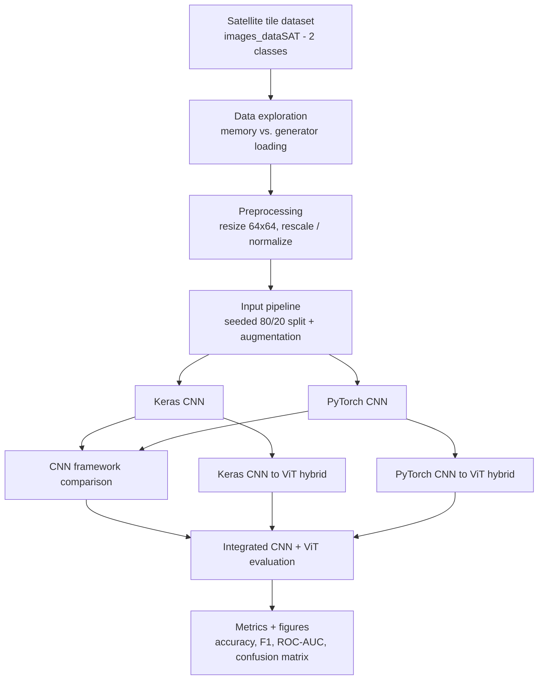

# Land Classification with CNNs and Vision Transformers

A deep-learning computer-vision project that classifies satellite land tiles as
**agricultural** or **non-agricultural**, and compares two model families and
two frameworks on the same task:

* **Convolutional Neural Networks** vs. **Vision Transformers**
* **TensorFlow / Keras** vs. **PyTorch**

It began as the capstone of the IBM AI Engineering Professional Certificate and
has been reorganised into a clean, framework-parallel Python package with a
documented methodology. See [Acknowledgements](#acknowledgements) for the
original source and scope.

---

## Overview

Mapping land use from satellite imagery supports agricultural monitoring, food-
security analysis, urban planning and environmental protection. This project
frames the simplest useful version of that problem &mdash; a **balanced binary
classification** of 64&times;64 RGB tiles &mdash; and uses it as a controlled
setting to study how model architecture and framework choice affect a small
image classifier.

Every model is implemented **twice**, once in Keras and once in PyTorch, from a
shared configuration so the comparison is like-for-like.

## Objectives

1. Build a portable, reproducible input pipeline for a two-class image folder.
2. Implement a convolutional classifier in **Keras** and in **PyTorch** with an
   identical convolutional feature extractor.
3. Implement a **CNN &rarr; Vision Transformer hybrid** in each framework, reusing
   the pretrained CNN as a tokenizer for a small transformer encoder.
4. Evaluate all models with a common metric bundle (accuracy, precision, recall,
   F1, ROC-AUC, confusion matrix).
5. Compare CNN vs. ViT and Keras vs. PyTorch on architecture, parameter budget
   and training behaviour.

## Tech Stack

| Area | Tools |
| --- | --- |
| Language | Python 3.11+ |
| Deep learning | TensorFlow / Keras 2.19, PyTorch 2.8, torchvision 0.23 |
| ML utilities | scikit-learn, NumPy |
| Visualisation | Matplotlib |
| Imagery | Copernicus Sentinel-2 derived tiles |

## Project Workflow



## Repository Structure

```
Land-Classification-CNN-ViT/
├── README.md
├── LICENSE                     # MIT - original code only (see scope note)
├── requirements.txt
├── .gitignore
│
├── src/
│   ├── config.py               # every hyperparameter, as dataclasses
│   ├── seeding.py              # deterministic seeding for all frameworks
│   ├── data.py                # portable Keras + PyTorch input pipelines
│   ├── train.py               # unified training CLI
│   ├── evaluate.py            # metrics, figures and evaluation CLI
│   └── models/
│       ├── keras_cnn.py       # Keras convolutional classifier
│       ├── pytorch_cnn.py     # PyTorch convolutional classifier
│       ├── keras_vit.py       # Keras CNN to ViT hybrid + custom layers
│       └── pytorch_vit.py     # PyTorch CNN to ViT hybrid
│
└── data/
    └── README.md              # dataset origin, licensing and setup
```

`checkpoints/` and `results/` are created on demand by the training and
evaluation scripts and are git-ignored.

### Relationship to the original capstone labs

The project reorganises nine IBM lab notebooks into reusable modules. The
notebooks themselves are **not** redistributed (they are IBM course material);
their functionality lives here:

| Original lab (module / lesson) | Where it lives now |
| --- | --- |
| M1L1 memory vs. generator loading | concepts documented here; superseded by `src/data.py` |
| M1L2 Keras data loading & augmentation | `src/data.py` (`build_keras_datasets`) |
| M1L3 PyTorch data loading & augmentation | `src/data.py` (`build_pytorch_loaders`) |
| M2L1 train & evaluate a Keras classifier | `src/models/keras_cnn.py`, `src/train.py` |
| M2L2 implement & test a PyTorch classifier | `src/models/pytorch_cnn.py`, `src/train.py` |
| M2L3 comparative analysis of the two CNNs | `src/evaluate.py` |
| M3L1 Vision Transformers in Keras | `src/models/keras_vit.py` |
| M3L2 Vision Transformers in PyTorch | `src/models/pytorch_vit.py` |
| M4L1 CNN + ViT integration & evaluation | `src/evaluate.py` |

## Dataset

Balanced two-class satellite-tile dataset (6,000 images, 3,000 per class,
64&times;64 RGB), derived from Copernicus Sentinel-2 Level-2A products and
packaged for the IBM course. It is not committed here.
**See [`data/README.md`](data/README.md)** for the download URL, licensing and
the required folder layout.

## Data Preprocessing

| Step | Keras | PyTorch |
| --- | --- | --- |
| Resize | 64&times;64 (`image_dataset_from_directory`) | 64&times;64 (`transforms.Resize`) |
| Scaling | `Rescaling(1/255)` &rarr; `[0, 1]` | `ToTensor` + ImageNet mean/std normalisation |
| Split | seeded 80 / 20 train/validation | seeded 80 / 20 via `random_split` |
| Train augmentation | `RandomFlip`, `RandomRotation`, `RandomZoom` | `RandomRotation`, `RandomHorizontalFlip`, `RandomAffine` (shear) |
| Validation | rescale only | resize + normalise only |

Two fixes over the source notebooks: environment-specific absolute paths were
replaced with repo-root-relative resolution, and the PyTorch split now applies
**different** transforms to the train and validation subsets (the notebooks
mutated a shared `transform` attribute after splitting).

## CNN Models

Both frameworks share the **same convolutional feature extractor**: six blocks of

```
Conv(5x5, padding=same) -> ReLU -> MaxPool(2) -> BatchNorm
```

with channel progression `32 -> 64 -> 128 -> 256 -> 512 -> 1024`. On a 64&times;64
input the feature map is reduced to `1 x 1 x 1024`.

The classifier heads differ &mdash; this asymmetry comes from the two original
labs and is preserved deliberately:

| | Keras (`keras_cnn.py`) | PyTorch (`pytorch_cnn.py`) |
| --- | --- | --- |
| Pooling | `GlobalAveragePooling2D` | `AdaptiveAvgPool2d(1)` |
| Head | 6 dense layers `64 -> 2048`, each + BatchNorm + Dropout(0.4) | 1 hidden layer `Linear(1024, 2048)` + BatchNorm + Dropout(0.4) |
| Output | `Dense(1, sigmoid)` | `Linear(2048, 2)` logits |
| Loss | binary cross-entropy | cross-entropy |
| Optimiser | Adam, lr 1e-3 | Adam, lr 1e-3 |
| Init | He-uniform | PyTorch default (Kaiming) |

## Vision Transformer Models

Both hybrids **freeze the pretrained CNN** and treat its `1 x 1 x 1024` feature
map as a token sequence for a small transformer encoder.

**Keras hybrid (`keras_vit.py`)**

* Feature map reshaped to tokens, plus a learnable positional embedding
  (`AddPositionEmbedding`, a registered Keras serializable layer).
* 4 post-norm `TransformerBlock`s: `MultiHeadAttention` (8 heads, `key_dim` =
  1024) + GELU MLP (hidden dim 2048), dropout 0.1.
* `GlobalAveragePooling1D` &rarr; `Dense(2, softmax)`.
* Adam at lr 1e-4, categorical cross-entropy.

**PyTorch hybrid (`pytorch_vit.py`)**

* `PatchEmbed`: a `1x1` convolution projecting `1024 -> 768` per spatial
  location.
* A learnable class token is prepended; a learnable positional embedding
  (`max_tokens = 50`) is added.
* 3 pre-norm `TransformerEncoderBlock`s (default): custom multi-head self-
  attention (6 heads) + GELU MLP (`mlp_ratio = 4`), dropout 0.1. The labs also
  exercised depth 4 / 4 heads and depth 6 / 8 heads.
* `LayerNorm` &rarr; `Linear(768, 2)` on the class token.
* Adam at lr 1e-3, cross-entropy.

## Model Evaluation

`src/evaluate.py` runs a trained model over the validation split and reports a
single metric bundle for every model:

* accuracy, precision, recall, F1 (binary, positive class = `agri`)
* ROC-AUC from the positive-class probability
* confusion matrix and full `classification_report`
* a saved confusion-matrix figure and, from training history, accuracy/loss
  curves

Metrics are written to `results/metrics/<framework>_<model>.json` and figures to
`results/figures/`.

## Results

**No performance metrics are reported in this repository.** The original lab
notebooks were never executed to completion (they contain stale error outputs),
and the pretrained weight files they depended on are IBM-hosted course
artefacts that are not redistributed here. Reproducing results requires
downloading the dataset and training the models locally with `src/train.py`.

Rather than publish numbers that cannot be reproduced from this repository, the
project documents the **exact architectures and hyperparameters** (above and in
`src/config.py`) and provides the scripts to generate genuine results. When you
run them, `src/evaluate.py` produces the metric bundle and figures described
above.

## Key Findings

These are design-level observations, not performance claims:

* **Input resolution starves the transformer.** At 64&times;64 the CNN feature
  map collapses to `1 x 1`, so the Keras hybrid sees a single spatial token.
  A meaningful ViT needs either a larger input, a shallower CNN tap point, or
  patchifying an earlier feature map &mdash; noted in [Limitations](#limitations).
* **Parameter budget is dominated by the dense heads**, not the convolutions:
  the Keras CNN's six-layer `64 -> 2048` funnel and the hybrids' `mlp_dim = 2048`
  blocks are where most weights live.
* **Framework differences are mostly ergonomic.** Keras favours declarative
  `Sequential`/functional models and built-in `fit`; PyTorch makes the training
  loop, freezing and feature tapping explicit. The two CNNs are architecturally
  equivalent apart from the deliberately different classifier heads.

## Installation

```bash
git clone https://github.com/Lujain-ALghamdi/Land-Classification-CNN-ViT.git
cd Land-Classification-CNN-ViT

python -m venv .venv
# Windows
.venv\Scripts\activate
# macOS / Linux
source .venv/bin/activate

pip install -r requirements.txt
```

Then obtain the dataset as described in [`data/README.md`](data/README.md).

## Usage

Run from the repository root so the `src` package is importable.

```bash
# Convolutional classifiers
python -m src.train --framework keras   --model cnn --epochs 3
python -m src.train --framework pytorch --model cnn --epochs 3

# CNN -> ViT hybrids (optionally seed the PyTorch backbone with trained CNN weights)
python -m src.train --framework keras   --model vit --epochs 5
python -m src.train --framework pytorch --model vit --epochs 5 \
    --backbone-weights checkpoints/pytorch_cnn.pth

# Evaluation
python -m src.evaluate --framework keras   --model cnn --weights checkpoints/keras_cnn.keras
python -m src.evaluate --framework pytorch --model cnn --weights checkpoints/pytorch_cnn.pth
```

`--help` on either script lists every option (`--data-dir`, `--output-dir`,
`--num-workers`, `--seed`, ...).

## Reproducibility

* **Seeding.** `src.seeding.seed_everything(seed)` seeds Python, NumPy,
  TensorFlow and PyTorch, and enables deterministic cuDNN. The Keras labs used
  seed `7331`, the PyTorch CNN lab used `42`; `7331` is the project default.
* **Deterministic splits.** Both pipelines derive the 80/20 split from the seed,
  so train/validation membership is stable across runs and frameworks.
* **Pinned dependencies.** `requirements.txt` pins the versions used for the
  original work.
* **Config in one place.** Every hyperparameter is a field on a dataclass in
  `src/config.py`.

| Hyperparameter | CNN | CNN &rarr; ViT hybrid |
| --- | --- | --- |
| Input | 64&times;64&times;3 | 64&times;64&times;3 |
| Batch size | 128 | 32 (PyTorch) / 4 (Keras) in the labs |
| Train / val split | 80 / 20 | 80 / 20 |
| Optimiser | Adam | Adam |
| Learning rate | 1e-3 | 1e-3 (PyTorch) / 1e-4 (Keras) |
| Loss | BCE (Keras) / CE (PyTorch) | CE (PyTorch) / categorical CE (Keras) |
| Epochs | 3 | 5 |
| Backbone | trained from scratch | frozen, pretrained CNN |
| Embedding dim | &ndash; | 768 (PyTorch) / 1024 (Keras) |
| Transformer depth | &ndash; | 3 (PyTorch) / 4 (Keras) |
| Attention heads | &ndash; | 6 (PyTorch) / 8 (Keras) |
| MLP size | &ndash; | 4&times; dim (PyTorch) / 2048 (Keras) |
| Dropout | 0.4 (head) | 0.1 (encoder) |

## Limitations

* **Results are not reproduced here** &mdash; see [Results](#results).
* **64&times;64 input** leaves the CNN&ndash;ViT hybrids with almost no spatial
  tokens; the transformer cannot show its strengths at this resolution.
* **Low epoch counts** (3 / 5) are inherited from the teaching labs and are not
  tuned for best accuracy.
* **Two-class, balanced, single-region** data (Sentinel-2 tiles over one area);
  findings will not transfer directly to multi-class land-cover mapping.
* The **Keras and PyTorch classifier heads differ**, so a CNN-vs-CNN comparison
  is not perfectly controlled (this is called out wherever it matters).
* No transfer learning, no hyperparameter search, no test set separate from the
  validation split.

## Future Improvements

* Larger input tiles (or an earlier CNN tap point) so the ViT sees a real token
  grid, plus true patch embedding.
* Transfer learning from ImageNet or a pretrained ViT backbone.
* Stronger, framework-matched augmentation and a proper held-out test split.
* Hyperparameter optimisation (learning rate, depth, heads, dropout).
* Multi-class land-cover labels and multi-region data.
* Explainability (attention roll-out, Grad-CAM) and a lightweight deployment
  path (ONNX / TF-Serving / TorchServe).

## Acknowledgements

This project was originally developed as part of the **IBM AI Engineering
Professional Certificate** (AI Capstone Project with Deep Learning) and has been
reorganised, validated, documented and prepared for portfolio presentation.

The original lab notebooks are &copy; Copyright IBM Corporation and are **not**
redistributed in this repository. The satellite imagery is derived from
**Copernicus Sentinel-2** data (&copy; European Union, contains modified
Copernicus Sentinel data); the labelled dataset bundle is distributed by IBM
Skills Network for the course. See [`data/README.md`](data/README.md).

## License

The original source code and documentation in this repository are released under
the [MIT License](LICENSE).

The license covers **only** the material authored for this repository. It does
not relicense the IBM AI Engineering course materials, the Sentinel-2 / IBM
dataset, or the third-party libraries in `requirements.txt` &mdash; each retains
its own terms, and no ownership over them is claimed.
